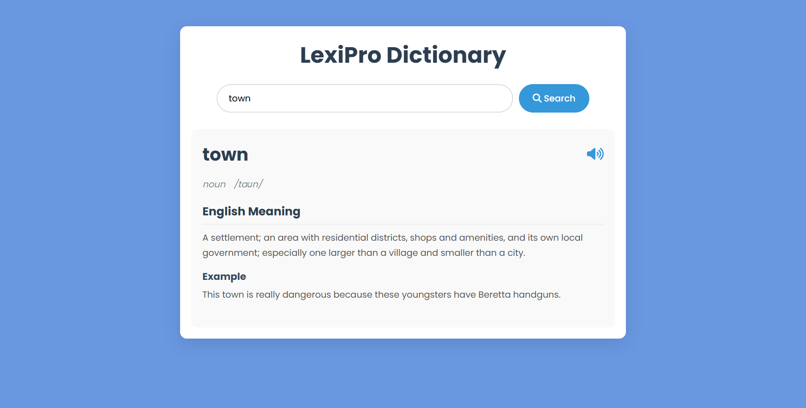

# 📘 LexiPro Dictionary

LexiPro is a clean and responsive dictionary web app built using **HTML**, **CSS** and **JavaScript**. It allows users to search any English word and get its **definition**, **pronunciation**, **part of speech**, and an **example sentence** — all in a sleek user interface.

---

## 🛠️ Tech Stack  
HTML,
CSS,
JavaScript

---

## ✨ Features

- 🔍 Real-time word search
- 🔊 Audio pronunciation (clickable icon)
- 📖 English definitions with parts of speech
- 💬 Example usage sentences
- 📱 Responsive design for all devices

---

## 📸 Screenshot

---
